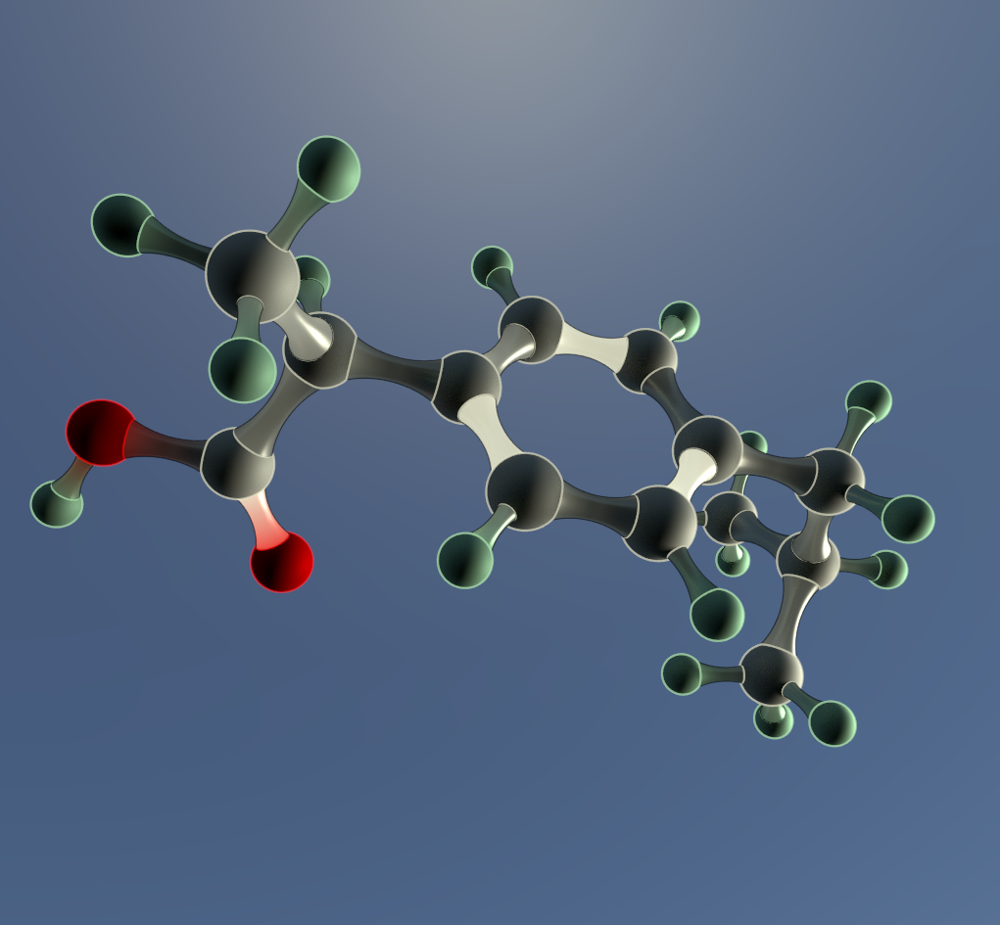

# moltoa
Python script to convert molecular structures in SDF format to Arnold renderer

Usage is:
```
python moltoa.py my_molecule.sdf
python moltoa.py --style toon my_molecule.sdf
```
This generates `my_molecule.ass` in the working directory, which can be rendered in Arnold with kick via e.g.:
```
kick -nostdin -device cpu -as 4 -ipr -i my_molecule.ass
```

")





